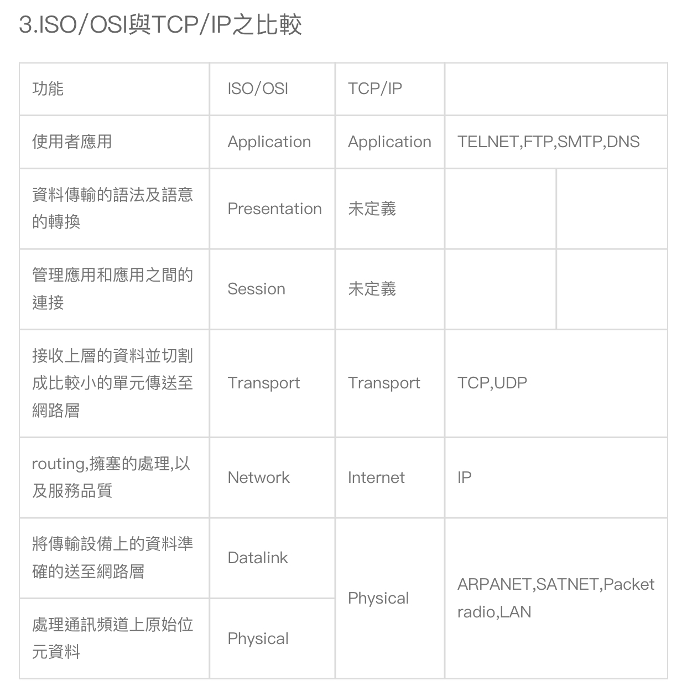

# mid-test
# 1.bandwidth與bps{相關}
1.bandwidth中文是頻寬
2.像高速公路一樣，車道多，速度越快。
3.計算單位是bps

# RFID
1.RFID = Radio  Frequency Identification 中文:無線射頻辨識
2.將數據傳出去做辨識
3.可應用房卡，門禁等

# NFC
1.NFC = Near-field communication
2.NFC是一套通訊協定，可以讓兩台手機近距離通訊
3.可以用來無線傳輸照片等
# Cellular network
1.中文為蜂巢式網路
2.常用於光纖與手機信號基地台
3.是一種行動通訊硬體架構

# Technology addiction
1.中文:科技成癮
2.分分秒秒離不開手機、電腦。
3.帶來
# crowdsourcing vs crowdfunding 比較
1.群眾募資就是從人那裡籌集資金
2.眾包就是從人群中採購任何東西
3.如果是服務，想法或信息，那就是眾包。
如果是錢，那就是眾籌。
# metadata
1.中文：後設資料、元數據
2.描述一個檔案的特徵的系統資料
3.有集中管理和分散管理
# CMS
1.content management system內容管理系統
2.瀏覽器就可以編輯網站
3.創建新網站很方便
# DDoS
1.distributed denial-of-service attack分散式阻斷服務攻擊
2.合法占用大量網路達到癱瘓網路及系統
3.有頻寬消耗型攻擊、資源消耗型攻擊
# Botent
1.中文殭屍網路
2.用程式去控制其他電腦並阻斷服務
3.具傳播性，危害程度高。
# RWD
1.全名：Responsive web design回應式網頁設計
2.能依照解析度改變網頁的顯示方式
3.能讓手機看網業不會那麼吃力
# SEO
1.search engine optimization搜尋引擎最佳化
2.提高搜尋引擎內排名
3.低成本高回報，增加銷售轉換率
### 2.問答與申論題 :OSI Model 與 TCP/IP protocol
# 1. 解釋 communication protocol(簡稱協定 protocol)
又稱通訊協定，雙方對資料傳送控制的一種約定。必須共同遵守
# 2.Why layering?
減少電腦通訊模式的多樣性，以利於溝通。
 # 3. 列出 OSI Model 與 TCP/IP protocol對應圖
   註 1: 需用中英文寫出各層的名稱
    註 2:須說明 OSI Model每一層的簡略功能

# 4. 簡述 下列協定的功能 與特色並說明它們 運作在 TCP/IP的哪一層?
   # (1)HTTP vs HTTPS 
   HTTP沒加密 HTTPS有加密，但利用SSL/TLS來加密封包 位於應用層
   (2) TELNET vs SSH 
   Telnet沒加密，帳密有可能外洩 SSH有加密，能在不安全的網路建一個安全通道。位於應用層
   (3)DNS 
   網際網路一種服務，使用TDP,UDP
   (4)IP 
   網路協定，用於封包交換，有IPV4 IPV6位於網路層。
   (5)ICMP
   能偵測回報機制，能檢測網路狀況。
   位於網路層
   

